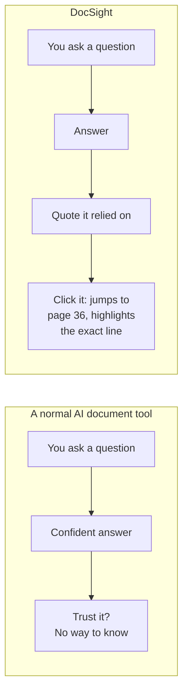
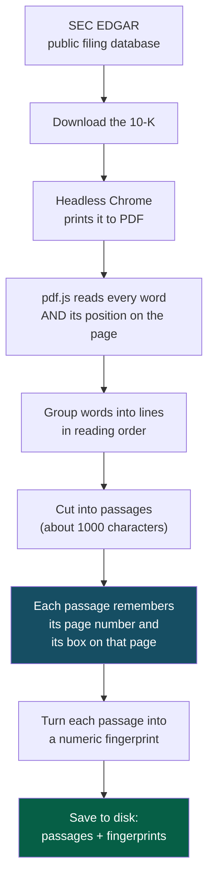
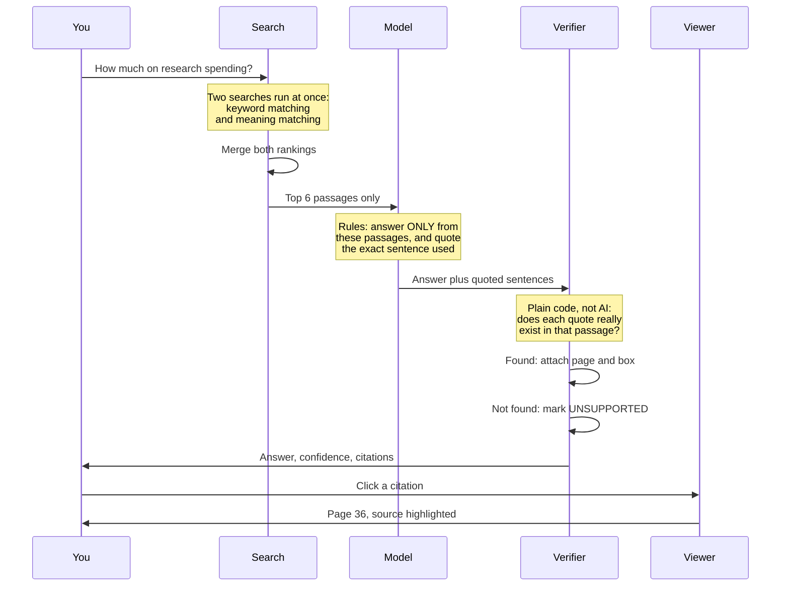
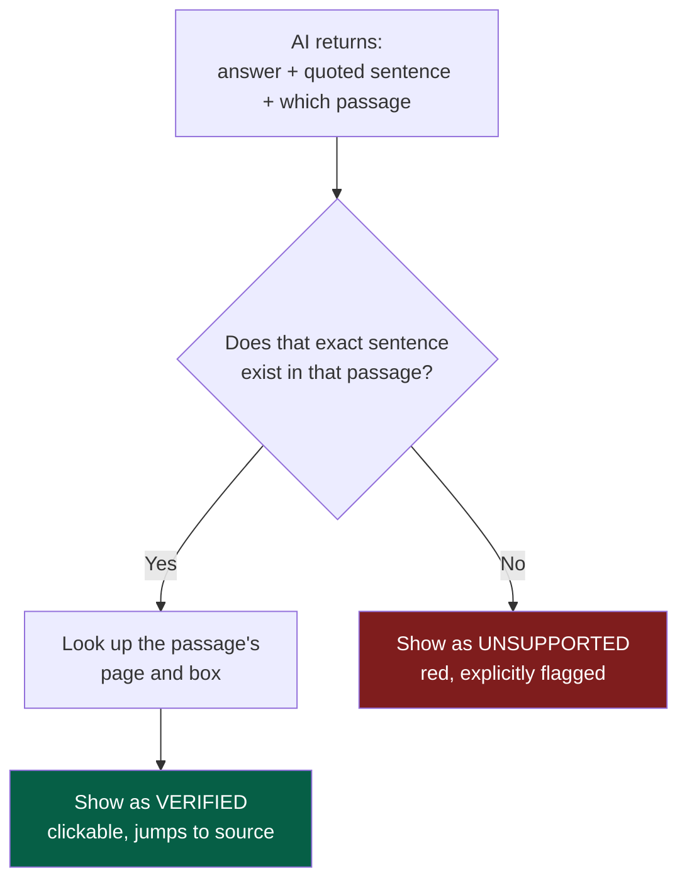
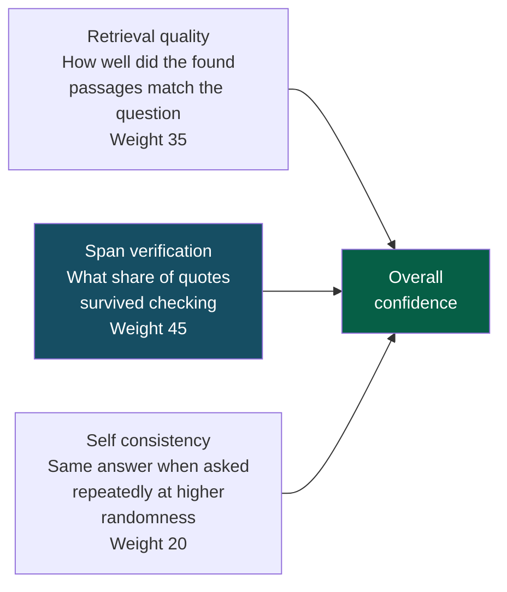

# DocSight

**Ask a 200 page financial document a question. Get an answer that proves where it came from.**

Most AI tools can answer questions about a document. Almost none can show you the exact sentence
they used, and none will tell you how often they get it wrong. DocSight does both.

---

## Table of contents

- [The problem in one minute](#the-problem-in-one-minute)
- [What it actually does](#what-it-actually-does)
- [How it works](#how-it-works)
- [The part that makes it different](#the-part-that-makes-it-different)
- [Where the confidence score comes from](#where-the-confidence-score-comes-from)
- [Benchmark results](#benchmark-results)
- [Running it yourself](#running-it-yourself)
- [Project structure](#project-structure)
- [Design decisions](#design-decisions)
- [Honest limitations](#honest-limitations)

---

## The problem in one minute

Imagine you ask a very confident intern to read a 200 page annual report and tell you how much the
company spent on research last year.

They come back with "34.5 billion dollars."

Are they right? You have no idea. They sound certain either way. To check, you would have to read
the 200 pages yourself, which defeats the point of asking. And if they were wrong, you would never
know until it mattered.

**This is exactly the problem with AI document tools.** They produce fluent, confident answers.
Sometimes the answer is invented. You cannot tell the difference by looking.

DocSight changes the deal. Every answer arrives with a receipt.



---

## What it actually does

Here is a real walkthrough, start to finish.

**1. You pick a filing.** Ten real annual reports (SEC form 10-K) from companies like Apple,
Nvidia and JPMorgan. Real documents, between 85 and 562 pages each.

**2. You ask a question.** For example: _"How much did Apple spend on research and development in
fiscal 2025?"_

**3. You get an answer with a receipt:**

> **34,550 million** &nbsp;&nbsp; `High confidence · 85%`
>
> **VERIFIED · PAGE 36**
> _"Research and development $ 34,550 10 % $ 31,370 5 % $ 29,915 Percentage of total net sales 8% 8% 8%"_

**4. You click the quote.** The PDF viewer jumps to page 36 and draws a box around the exact region
that sentence came from. You can see the source with your own eyes in about one second.

**5. If the answer is not in the document, it says so.** Ask "how many employees does Apple have in
Brazil?" and it declines instead of inventing a number. Refusing correctly counts as a right answer
in the benchmark, because a system that guesses is worse than one that admits ignorance.

---

## How it works

There are two separate phases. One happens once per document, ahead of time. The other happens when
you ask a question.

### Phase one: preparing a document (happens once)



The highlighted step is the one everything else depends on. When pdf.js reads a PDF, it reports not
just the text but **where on the page each fragment sits**. If that position information survives
all the way through to the final answer, we can highlight the source. If any step drops it, the
whole feature is impossible. So provenance is treated as sacred: every transformation carries the
page number and the bounding box forward.

The "numeric fingerprint" is called an embedding. It is a list of 384 numbers that captures the
_meaning_ of a passage, so passages about similar topics end up with similar numbers. This lets us
find relevant passages by meaning rather than by exact keyword.

### Phase two: answering a question (happens per question)



Two details worth pausing on:

**Why two searches instead of one?** Meaning based search alone was tested first and it failed on
financial tables. Asked about research spending, it ranked unrelated finance heavy passages above
the actual line containing the number. Keyword search catches what meaning search misses, and the
reverse is also true, so both run and their rankings are merged. This failure and its fix are
recorded in [`CLAUDE_GOTCHAS.md`](CLAUDE_GOTCHAS.md).

**Why only 6 passages?** The AI never sees the whole document. It sees a handful of relevant
passages and is told to use nothing else. That constraint is what makes grounding possible: if the
answer is not in those passages, the correct response is to refuse.

---

## The part that makes it different

Think of it as **an open book exam with a strict proctor.**

The AI is the student. It may answer only from the pages in front of it, and it must underline every
sentence it relied on. Then a proctor checks each underline against the real book. Any claim whose
underline cannot be found is marked unsupported.

The proctor is **plain code, not AI.** This matters enormously. Asking an AI to check its own work
just gets you a second confident opinion. Instead, a string search looks for the quoted sentence in
the source text. Either the text is there or it is not. There is no judgement involved and nothing
to hallucinate.



One wrinkle worth knowing: PDFs use typographic characters that an AI reproduces as plain
equivalents. Curly quotes become straight ones, unusual dashes become ordinary ones, spacing
differs. So both sides are normalised before comparison. Otherwise correct quotes would fail
verification on invisible punctuation differences.

**This mechanism was audited independently.** A separate script re-extracts each cited page directly
from the PDF, deliberately ignoring the prepared passage files, and confirms the quote is really
there. Result: **17 out of 17 verified citations genuinely appear on the page they claim.** Bypassing
the prepared files matters, because it means a bug in the preparation step cannot hide itself.

---

## Where the confidence score comes from

The score is **computed from three measurements**, not asked of the AI. A model's own stated
confidence is close to worthless: models report high confidence while being wrong.



Span verification carries the most weight because it is the only signal measured against ground
truth. The other two are indicators; that one is a fact.

Self consistency is a useful trick: ask the same question several times with randomness turned up.
A model that knows the answer says the same thing every time. A model that is guessing produces
different answers, and the disagreement exposes the guess.

The weights are an editorial choice, documented in
[`src/lib/qa/confidence.ts`](src/lib/qa/confidence.ts), not learned values. Hovering the badge in
the app shows the three parts individually.

---

## Benchmark results

A gold set of **49 questions** across the ten filings, each with a known correct answer. Thirty nine
ask for verifiable figures. Ten are refusal probes, asking for facts the documents do not contain.

Every model runs the identical pipeline: same retrieval, same prompt, same verification. Only the
model changes.

| Model       | Accuracy | Correct refusals | Verified citations | Avg time |
| ----------- | -------- | ---------------- | ------------------ | -------- |
| qwen3:4b    | **92%**  | 100%             | **92%**            | 186.5s   |
| gemma3:4b   | 82%      | 100%             | 59%                | 14.1s    |
| llama3.2:3b | 79%      | 90%              | 44%                | 5.5s     |

**Read the citation column, not the accuracy column.** Accuracy across the three models is fairly
close, between 79% and 92%. But the rate at which their quoted sentences survive verification ranges
from 44% to 92%.

That gap is the whole point of this project. The weaker models frequently produced **the right
answer while citing a sentence they had invented.** Judged on answers alone they look acceptable.
Judged on whether they can prove their answers, they fall apart. A tool that only measured accuracy
would have called them good enough.

### What the eval caught in its own author

An earlier run scored Disney far worse, and I wrote that up as a chunking weakness. It was not. Two
Disney questions asked for "net income" when the income statement reports two different figures:
total net income including noncontrolling interests, and net income attributable to Disney. The
models answered with the attributable figure and cited it correctly. **My label was wrong, and the
models were right.** Naming the exact line item lifted qwen3 from 87% to 92%.

Without a gold set to disagree with, an ambiguous question just yields a confident answer and nobody
notices which side the mistake is on. Building the eval is what surfaced my own error, which is a
better argument for evals than any number in the table.

### The one remaining consistent failure

Asked for Disney's fiscal 2024 revenue, two of three models get it wrong. Diagnosing it separated
retrieval from reasoning: the answer is technically retrieved, at rank 4, but the passage it arrives
in is a **segment breakdown table** reading `$ 41,186 $ 17,619 $ 34,151 $ (1,595) $ 91,361`. The two
passages that state it plainly as `Total revenues 94,425 91,361 3 %` rank outside the top 6.

So the number reaches the model in its least legible form. That is a retrieval ranking problem, not
a model problem, and the fix belongs in chunking or ranking rather than in prompting. It is the
clearest next piece of work.

Latency reflects a laptop running local models, not a datacenter.

Reproduce it with `npm run eval`. The gold set and harness are both in this repository.

---

## Running it yourself

### What you need

- **Node.js 22 or newer**
- **[Ollama](https://ollama.com)** if you want to ask your own questions locally, plus a model:
  `ollama pull qwen3:4b`
- **Google Chrome**, used only when preparing new documents

You do not need Ollama just to browse. The suggested questions ship with precomputed answers, so the
demo works with no model and no API key at all.

### Start it

```bash
npm install
npm run dev
```

Open the address it prints. Pick a filing, click a suggested question, click the citation.

### Every command

| Command                               | What it does                                  |
| ------------------------------------- | --------------------------------------------- |
| `npm run dev`                         | Start the app                                 |
| `npm run build`                       | Type check and build for production           |
| `npm test`                            | Run the unit tests (66 tests)                 |
| `npm run lint`                        | Lint                                          |
| `npm run format`                      | Format with Prettier                          |
| `npm run smoke`                       | Check the local model connection works        |
| `npm run ask -- AAPL "your question"` | Ask from the terminal                         |
| `npm run ingest`                      | Prepare all ten documents from scratch (slow) |
| `npm run ingest -- AAPL`              | Prepare one document                          |
| `npm run eval`                        | Run the full benchmark (hours)                |
| `npm run eval -- gemma3:4b`           | Benchmark one model                           |
| `npm run precompute`                  | Generate the suggested answers                |

### Asking your own questions

Two ways, and neither costs money:

**Local model.** Select "Local Ollama" in the app. Everything runs on your machine, completely
private, nothing leaves it. The tradeoff is real: a thinking model holds about 3.5GB in memory and
takes minutes per answer.

**Your own Gemini key.** Select "Gemini (your key)" and paste a free key from
[aistudio.google.com](https://aistudio.google.com). Your browser calls Google directly. The key is
held in the tab's memory only, is never stored, and never touches any server of ours. Seconds per
answer instead of minutes.

---

## Project structure

```
docsight/
├── src/
│   ├── lib/
│   │   ├── pipeline/        Reading PDFs, chunking, embedding
│   │   │   ├── extract.ts     Text plus coordinates out of a PDF
│   │   │   ├── lines.ts       Fragments into reading order lines
│   │   │   ├── chunk.ts       Lines into passages, provenance intact
│   │   │   ├── embed.ts       Passages into numeric fingerprints
│   │   │   └── document.ts    The three above, composed
│   │   ├── retrieval/      Finding relevant passages
│   │   │   ├── lexical.ts     Keyword search (BM25)
│   │   │   ├── fuse.ts        Merging two rankings
│   │   │   └── search.ts      Both searches combined
│   │   ├── qa/             Asking and checking
│   │   │   ├── prompt.ts      The grounding rules given to the model
│   │   │   ├── parse.ts       Reading the model's structured reply
│   │   │   ├── verify.ts      THE ANTI HALLUCINATION CHECK
│   │   │   ├── confidence.ts  Composing the three signals
│   │   │   └── ask.ts         The whole flow, orchestrated
│   │   ├── providers/     Model access (nothing else calls a model)
│   │   ├── eval/          Benchmark scoring
│   │   ├── hooks/         React data loading
│   │   └── types.ts       The core contracts
│   ├── components/Demo/   The interface, including the PDF viewer
│   └── pages/             Demo page and benchmark page
├── scripts/               Thin command line wrappers, run locally
├── data/gold/             Hand labelled benchmark questions, reviewed like code
└── public/data/           Generated: PDFs, passages, fingerprints, results
```

Two rules hold this together. **All model access goes through the provider interface**, so swapping
Ollama for Gemini is a constructor change rather than a refactor. **Pipeline logic lives in
`src/lib/pipeline`**, so the command line scripts and the browser run identical code rather than two
copies that drift apart.

### The stack

Vite, React, TypeScript and Tailwind for the app. pdf.js for reading and rendering PDFs.
transformers.js for embeddings computed locally. Vitest for tests. Deployed as a static site.

---

## Design decisions

**No server, and no API key in the deployed site.** The site is static files. Suggested answers are
precomputed, search runs in your browser, and live questions use your own key. There is no
credential to leak and no bill to run up, by construction rather than by policy.

**Vite rather than Next.js.** With no server side work to do, server rendering and API routes would
sit unused. What remains is a React single page app, which is what Vite is for.

**Open models rather than a paid API.** The benchmark asks whether freely available models can do
grounded extraction with verified citations. That question is more interesting than another
comparison of paid frontier models, and it keeps the whole project free to reproduce.

**The verifier is code, not a model.** Explained above, and worth restating: asking an AI to grade
its own work produces another opinion, not a check.

**Failures are recorded, not hidden.** [`CLAUDE_GOTCHAS.md`](CLAUDE_GOTCHAS.md) documents real
problems hit during development, including the meaning based search failure and three distinct ways
a thinking model can return nothing at all. Those notes are more useful than a clean history.

---

## Honest limitations

- **Ten documents, one document type.** All are SEC 10-K filings. Other formats are untested.
- **Gold labels are hand written and can be wrong.** Two ambiguous ones were already found and
  corrected. Forty nine questions is a small enough set that others may remain.
- **Ranking prefers the wrong table sometimes.** Prior year figures in multi year statements can
  surface from a segment breakdown rather than the income statement, as documented above.
- **Highlights cover the passage, not the sentence.** The box surrounds the region the passage came
  from, which is precise enough to find the source instantly but is not a word level highlight.
- **The gold set is 49 questions.** Enough to expose the citation gap between models, not enough for
  statistically tight numbers.
- **Local models are slow.** Around three minutes per answer for the most accurate one, on a laptop.
- **Scanned documents will not work.** Text extraction needs a real text layer. No OCR step exists.

---

## Where the idea came from

Professionally I build AI features on AWS Bedrock for a property inspection platform: document
extraction, confidence scoring and citation tracking against real customer reports. That work is in
a private repository, so none of it can be shown.

DocSight applies the same techniques to public data instead. Different documents, different domain,
nothing borrowed but the approach.

**Florante G. Clavano Jr.** &nbsp;·&nbsp; Electronics and Communications Engineer turned Full Stack
Engineer &nbsp;·&nbsp; Cebu City, Philippines
